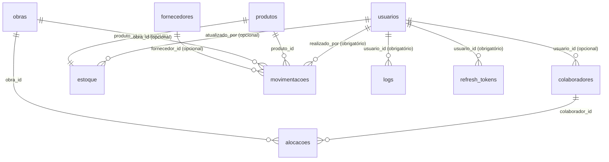

# Relacionamentos — Banco de Dados

→ [[ÍNDICE]] | [[Documentação banco]] | [[Banco.sql]]

## Diagrama ERD



---

## Mapa de Foreign Keys

| Tabela | Coluna FK | Referencia | Obrigatória |
|---|---|---|---|
| `colaboradores` | `usuario_id` | `usuarios.id` | Não |
| `alocacoes` | `colaborador_id` | `colaboradores.id` | Sim |
| `alocacoes` | `obra_id` | `obras.id` | Sim |
| `estoque` | `produto_id` | `produtos.id` | Sim (UNIQUE) |
| `estoque` | `atualizado_por` | `usuarios.id` | Não |
| `movimentacoes` | `produto_id` | `produtos.id` | Sim |
| `movimentacoes` | `obra_id` | `obras.id` | Não |
| `movimentacoes` | `fornecedor_id` | `fornecedores.id` | Não |
| `movimentacoes` | `realizado_por` | `usuarios.id` | Sim |
| `logs` | `usuario_id` | `usuarios.id` | Sim |
| `refresh_tokens` | `usuario_id` | `usuarios.id` | Sim |

---

## Relacionamentos Polimórficos em `movimentacoes`

> [!warning] Sem FK formal — integridade garantida pela aplicação
> `origem_id` e `destino_id` não têm FOREIGN KEY constraint no banco.

| Campo | Valores possíveis de `*_tipo` | Aponta para tabela |
|---|---|---|
| `origem_tipo` / `origem_id` | `'obra'` | `obras.id` |
| `origem_tipo` / `origem_id` | `'fornecedor'` | `fornecedores.id` |
| `origem_tipo` / `origem_id` | `'deposito'` | `depositos.id` |
| `destino_tipo` / `destino_id` | `'obra'` | `obras.id` |
| `destino_tipo` / `destino_id` | `'fornecedor'` | `fornecedores.id` |
| `destino_tipo` / `destino_id` | `'deposito'` | `depositos.id` |

---

## Colunas Geradas (GENERATED ALWAYS AS … STORED)

| Tabela | Coluna | Fórmula |
|---|---|---|
| `estoque` | `valor_total` | `quantidade * valor_unitario` |
| `movimentacoes` | `valor_total` | `quantidade * valor_unitario` |

Calculadas automaticamente pelo banco — nunca inserir ou atualizar manualmente.

---

## Soft Delete

Tabelas com `deleted_at TIMESTAMPTZ`:

`usuarios` · `colaboradores` · `fornecedores` · `depositos` · `obras` · `produtos` · `estoque` · `movimentacoes`

> [!note] Exceções sem soft delete
> `alocacoes`, `logs` e `refresh_tokens` **não** possuem `deleted_at`. Em `refresh_tokens`, o registro é deletado permanentemente no logout.

---

## Índices

```sql
-- Foreign keys
idx_colaboradores_usuario  ON colaboradores(usuario_id)
idx_alocacoes_colaborador  ON alocacoes(colaborador_id)
idx_alocacoes_obra         ON alocacoes(obra_id)
idx_estoque_produto        ON estoque(produto_id)
idx_movimentacoes_produto  ON movimentacoes(produto_id)
idx_movimentacoes_obra     ON movimentacoes(obra_id)
idx_logs_usuario           ON logs(usuario_id)
idx_logs_tabela            ON logs(tabela_afetada)
idx_logs_created           ON logs(created_at)

-- Filtros e ranges frequentes
idx_movimentacoes_tipo     ON movimentacoes(tipo)
idx_movimentacoes_created  ON movimentacoes(created_at)
idx_movimentacoes_origem   ON movimentacoes(origem_tipo, origem_id)
idx_movimentacoes_destino  ON movimentacoes(destino_tipo, destino_id)

-- Fase 8 — KPIs do dashboard (pedidos pendentes por obra)
idx_movimentacoes_status   ON movimentacoes(status)
idx_movimentacoes_obra_kpi ON movimentacoes(obra_id, status, data_necessidade)
```
